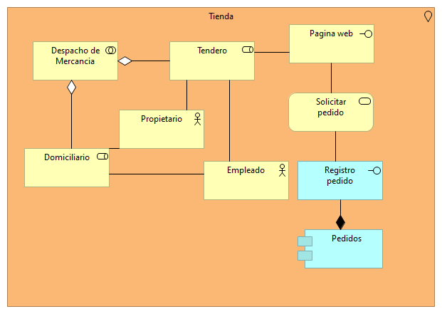
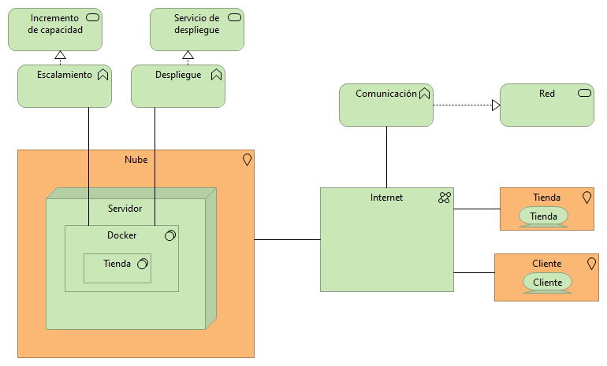
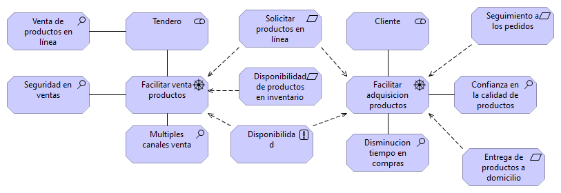
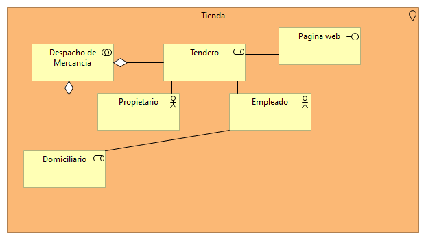
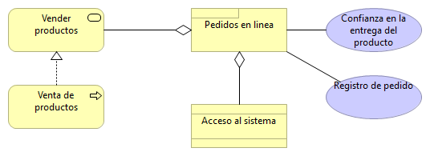

<h2>Tienda de barrio</h2>
<h1>Integrantes</h1>
<h3>Juan Camilo Guaba  </h3>
<h3>Wilmer Ricardo Pachón</h3>

Para el desarrollo de algunas funcionalidades en especial micro servicios del aplicativo de la tienda de barrio se tuvieron en cuenta unos diagramas previos mostrados a continuación

<h2>
    Actor - cooperación
</h2>

<h2>Aplicaciones</h2>

<h2>Contribución de objetivos</h2>

<h2>Cooperación de aplicacion</h2>

<h2>Cooperación de proceso de negocio</h2>

<h2>Estructura de aplicaciones</h2>

<h2>Estructura de información</h2>

<h2>funciones del negocio</h2>

<h2>Infraestructura</h2>

<h2>Microservicios</h2>

<h2>Motivación</h2>

<h2>Organización</h2>

<h2>Procesos de negocio</h2>

<h2>Producto</h2>

<h2>Realizacion de requerimientos</h2>

<h2>Realizacion del servicio</h2>

<h2>Resumen por capas</h2>

<h2>Uso de aplicacion</h2>

<h2>Uso de Infraestructura</h2>
