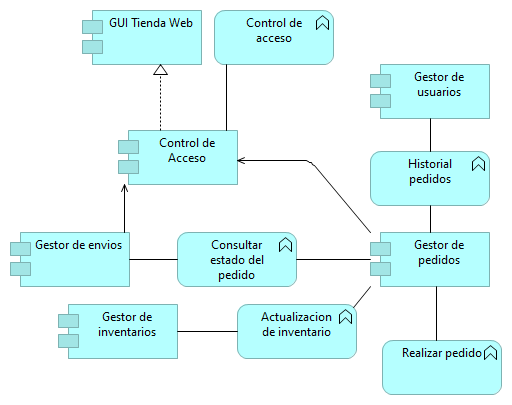

<h2>Tienda de barrio</h2>
<h1>Integrantes</h1>
<h3>Juan Camilo Guaba  </h3>
<h3>Wilmer Ricardo Pachón</h3>

Para el desarrollo de algunas funcionalidades en especial micro servicios del aplicativo de la tienda de barrio se tuvieron en cuenta unos diagramas previos mostrados a continuación

<h2>
    Actor - cooperación
</h2>

<h2>Aplicaciones</h2>

<h2>Contribución de objetivos</h2>

<h2>Cooperación de aplicacion</h2>

<h2>Cooperación de aplicacion</h2>

<h2>Cooperación de aplicacion</h2>

<h2>Cooperación de aplicacion</h2>

<h2>Cooperación de aplicacion</h2>

<h2>Cooperación de aplicacion</h2>

<h2>Cooperación de aplicacion</h2>

<h2>Cooperación de aplicacion</h2>

<h2>Cooperación de aplicacion</h2>

<h2>Cooperación de aplicacion</h2>

<h2>Cooperación de aplicacion</h2>

<h2>Cooperación de aplicacion</h2>

<h2>Cooperación de aplicacion</h2>

<h2>Cooperación de aplicacion</h2>

<h2>Cooperación de aplicacion</h2>

<h2>Cooperación de aplicacion</h2>
